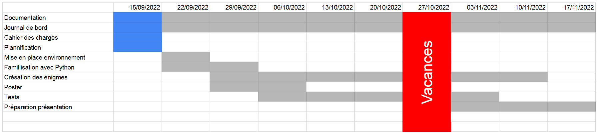

# Cahier des charges: Case Enigma
#### DOMINGUES PEDROSA Samuel

## Sujet
Crée un jeu de puzzle avec un CrowPi

## But
Le but du jeu est de résoudre une série d'énigmes en utilisant les diverts composants d'un CrowPi, une mallete avec un écranet un circuit avec des composant utilisables avec un Raspberry Pi.

## Spécifications
Le jeu se découpe en plusieurs énigmes qui devront utiliser un ou plusieurs composant du CrowPi. Si le joueur réussi l'énigme, il passe à la suivante jusq'a la fin du jeu. S'il échoue, il recommence et à droit à un indice s'il recommence 3 fois. Le jeu commence dans un menu que l'on peut revenir à tout moment en appuyant sur un bouton dédier avec l'écran tactile et ou ll'on peut choisir une énigme (qui sont toutes bloquées de base sauf pour la première).

## Restrictions
Pas tout les composants du CrowPi sera utilisé

## Environnement
- Language : Python
- Environnement
    - Windows 10
    - Raspberry Pi OS
    - Visual Studio Code
- Matériel : 
    - Raspberry Pi 4
    - CrowPi
- Versionning : Git
- Documentation : MkDocs

## Livrables
- Poster
- Documentation
- Journal de bord
- Code source du projet

## Rédditions
2022.10.13 : Rendu du poster

2022.10.23 : Rendu du rapport intermédiaire

2022.11.20 : Rendu final

2022.11.24 : Exposé oral

## Planning
