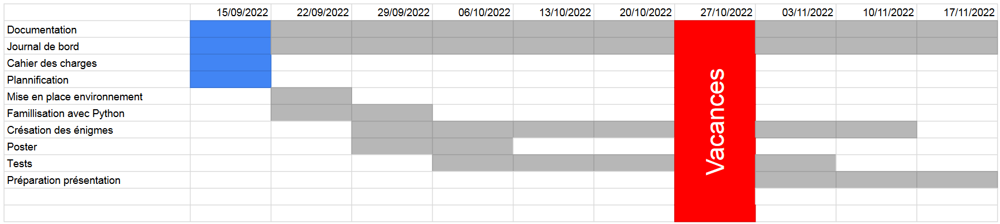

# Case Enigma

Case Enigma est un jeu de puzzle qui utilise le CrowPi pour ses énigmes.

Le jeu se présente comme une série d'écrans sur lequel est affiché l'énigme. Si le joueur se trompe 3 fois, il peut découvrir un indice pour cette enégme.

J'ai choisi cette idée car j'avais déjà vu le CrowPi par le passé et cette boîte m'a intrigé. J'ai donc pris l'occasion de pouvoir non seulement utiliser le CrowPi tout en améliorant mes compétences en Python et en gestion d'entrées/sorties en prévision de mon travail de diplôme

## Présentation du jeu
### Niveau 1 : Code au D-Pad
Cette énigme demande de faire un code à l'aide de la croix de boutton située en bas du CrowPi.

En interne, on regarde si on reçois un input sur l'une des PINs du d-pad. On ajoute une lettre corespondant à la tentative de code, représentée par une chaîne, et on la compare au code. Si elle est fausse, on recommence.

{: style="height:300px"}

J'ai choisi cette énigme parce que les boutons sont un input très basique, donc simple à utiliser quand on commence à utiliser les GPIO, et si on demande à quelqu'un de faire un code avec un d-pad, il y a de grandes chanses qu'il fasse le Konami Code.

Solution: ↑↑↓↓←→←→
Explication de l'indice: Contra, le jeu qui a rendu populaire le Konami Code

## Niveau 2 : Scanner de paume
Cette énigme "scanne" la paume de la main mais demande d'être à une distance précise

En réalité, le scanner est un capteur de distance à ultrason. On envoie un très court ultrason, on prend le temps, ce qu'on refait quand l'ultrason revient, et on soustracte les deux pour obtenir la distance.

{: style="height:300px"}

J'ai fait cette énigme car je trouve intéressant l'idée d'utiliser du son pour calculer des distances. L'idée d'en faire un scanner vient du fait que quand je testais le code, je mettais ma main à plat pour donner le plus de surface pour réfléchir les ultrasons.
Solution: mettre 15 cm de distance au capteur
Explication de l'énigme: 1 minute = 60 secondes, / 4 = 15 secondes donc 15 cm

## Niveau 3 : Code morse
Cette énigme demande de faire un code Morse avec le capteur de toucher

En interne, cette énigme est très similaire à la première. Pour calculer le temps et déterminer le caractère, on ajoute un event listener é la PIN avec un callback à une fonction qui enregistre le temps pour quand on appuie et quand on relâche. Puis dans la fonction du niveau, on regrade le temps maintenu pour choisir le caractère.

{: style="height:300px"}

J'ai choisi cette énigme car je voulais savoir comment faire pour tester l'état un input en Python et vu que j'avais déjà utilisé les boutons, j'ai eu l'idée d'utiliser le capteur de toucher et donc d'avoir l'idée de faire passer ça pour un test d'empreintes digitales.

Solution: .../---/... (SOS)
Explication de l'indice: SOS est le code Morse le plus facile à faire (c'est pour ça que c'est SOS), donc si du morse est utilisé pour un mot de passe, ce serait équivalent à utiliser 1234

# Plannings
## Prévisonnel

## Réel
