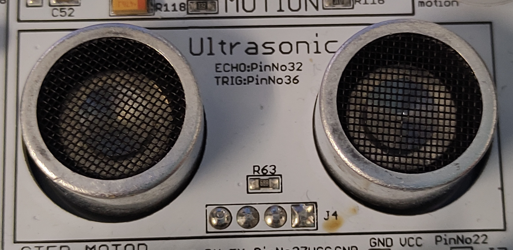

# Journal de bord

## 2022.09.15
Vu que je ne fait plus le projet VR avec rami, je doit refaire un cahier des charges pour mon projet solo.

Je prépare déjà Rapberry Pi Imager pour la semaine prochaine.

## 2022.09.22
J'ai installé une installation clean de Raspberry Pi OS. Je vais surtout regarder quelques tutos pou voir comment intéragir avec le CrowPi et commencer à faire le poster.

J'ai essayer le code de démo du LCD mais on me dit que j'ai pas la librairie et j'en installe une mais, soit j'ai installé la mauvaise, soit la librairie à beaucoup changée, mais je n'arrive pas à le faire fonctionner.

## 2022.09.29
Ce qui est bizzare c'est que les pin de la criox  marquées dans le circuit du CrowPi et celles qui faut utiliser dans le programme sont différentes. Par exemple, pour le bouton haut ça dit qu'il faut utiliser la pin 37 mais dans le programme c'est la pin 26.

Il y a le même problème que chez moi ou pygame sur Linux à l'air de crasher quand on quitte.

Problême réglé, c'est que je reset le GPIO et après j'en utilise une.

Après avoir vu la doc, RPi.GPIO.BCM met les Pin dans un ordre différent.

J'ai réussi à faire intéragir les GPIO et pygame

## 2022.10.06
J'ai pu faire en sorte qu'un bouton ne puisse pas faire constament une action quand un boutton est maintenu.

## 2022.10.20
J'ai décidé de mettre le code de l'énigme que j'ai fair dans une fonction à part et en laissant la variable qui contient la tentative dehors, mais ça me retourne une erreur qui me dit que la variable est référencée avant d'être assignée. Ce qui est fait exprès.

Je pense savoir où est le problème, j'ai passé la variable en local mais maintenant une autre variable qui sert à empécher le code de prendre en compte le bouton s'il est maintenu revoir la même erreur Ce qui veut dire que le code ignore les variables global.

J'ai trouvé la solûtion. Je devais juste déclarer que ces variables étaient globales au début de la fonction.

J'ai essayé d'exécuter le script de démo de la matrice LED, mais même après avoir installé les librairies qui faut, il n'arrive pas à utiliser le SPI pour communiquer avec la matrice.

## 2022.11.03
Aujourd'hui mon objectif est de créer une énigme ou il faut crier au bon volume.

En regrdant j'ai vu que à partir de Python 3.10, le language possède un équivalant au switch case avec match, mais la version de Raspberry Pi OS est encore en 3.9.2, donc je vais plutôt utiliser les elif en cascade.

J'abandone l'idée du micro car les GPIO ne sont que digitale. A la place j'aurais une énigme qui utilise le capteur de distance.
{: style="height:300px"}

J'ai pu afficher du text avec pygame. C'est facile mais il y a un peu de boilerplate code. Il faut créer un objet pour la police, puis pour le texte et un rectangle pour le texte.

``` python
font = pygame.font.sysFont('freesansbold.ttf', 32) # Initialiser la police
text = font.Render('Vies : 3', True, (0, 0, 0)) # Créer l'objet texte
text_rect = text.get_rect() # Obtenir la boîte pour afficher le texte
screen.blit(text, text_rect) # Afficher le texte
```

En essayent de push les changements d'aujourd'hui je me rends compte que j'ai oublié de pull avant de commencer et j'ai un conflict que j'ai besoind de résoudre.

## 2022.11.10
Honnêtement résoudre un conflict avec Vim était plutôt simple.

Aujourd'hui, mon objectif est de créer une troisième voir une quatrième énigme.

Pour ma troisième énigme, je pensait à devoir écrire un message en Morse avec le détecteur de touché.

{: style="height:300px"}

J'ai un peu modifié le code de la deuxième énigme pour affiche un vague message qui dit si on est trop haut ou trop bas au lieu de la distance elle même.

# 2022.11.17
J'ai un peut regarder comment calculer un interval de temps qu'un bouton est préssé, et quand je rajoute un bool pour ne pas innoder la console, ça me mets des résultats incorrectes.

J'ai mis le code dans un callback et ça fonctionne

J'ai un peut regarder comment calculer un interval de temps qu'un bouton est préssé, et quand je rajoute un bool pour ne pas innoder la console, ça me mets des résultats incorrectes.

J'ai mis le code dans un callback et ça fonctionne

# 2022.11.19
Vu que je doix vérifier deux chaînes de la même manière, j'ai mis le code dans une fonction séparée.

Pour gérer le callback, j'ai mis la variable en globale que je vérifie pour voir si la valeur est supérieure à 0, puis je regarde la durée pour déterminer si c'est un cours (.) ou un long (-)

Quand je fait un long, il est reconnu mais quand je fait un cours, il ne se passe rien.

J'avais mis un temps pas asssez intuitif pour un cours